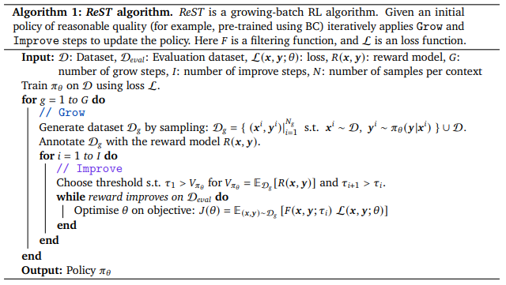
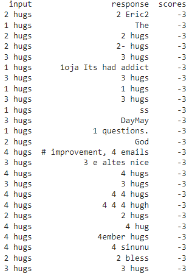
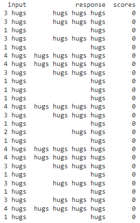

# Hugging ReST
This repo contains my implementation of the Reinforced Self-Training (ReST) for Language Modeling algorithm described in Google Deepmind's paper located at: https://arxiv.org/pdf/2308.08998.pdf. I would highly recommend giving it a read! 

**This repo is NOT an official implementation of their work.**

# ReST Psuedocode

And a visualization of ReST's workflow...

Both images credit to: https://arxiv.org/pdf/2308.08998.pdf.

# The Implementation
The Google Colab file and matching python script use the Hugging Face Transformers library to fine-tune an LM (t5-small) using the reinforcement learning method, ReST. This training script contains a *dummy* reward model that rewards the generator being fine-tuned based on how many times it generates the word "hugs". The desired number of "hugs" generations is passed as input to the model during training. 

Because it uses the Hugging Face Transformers library for fine-tuning, this implementation is easily **transferable**, and with just a few changes can be used with many LLM's given that they are hosted on Hugging Face. The *dummy* reward model in this implementation can also be changed to any text-based classifier that produces rewards. The reward model used for ReST training can range from the simple *dummy* reward model here to another LLM. Human preference scores of generated texts are fair game too.    

## Model output prior to dummy RL

## Model output after dummy RL

