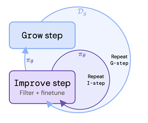

# Hugging ReST
This repo contains my implementation of the Reinforced Self-Training (ReST) for Language Modeling algorithm described in Google Deepmind's paper located at: https://arxiv.org/pdf/2308.08998.pdf. I would highly recommend giving it a read!

**This repo is NOT an official implementation of their work.**

# ReST Psuedocode

And a visualization of ReST's workflow...

Both images credit to: https://arxiv.org/pdf/2308.08998.pdf.

# The Implementation
The Google Colab file and matching python script use the huggingface transformers library to fine-tune an LM (t5-small) using the reinforcement learning method, ReST. This training script contains a *dummy* reward model that rewards the generator being fine-tuned based on how many times it generates the word "hugs". The desired number of "hugs" generations is passed as input to the model during training. 

## Model output prior to RL

## Model output after RL

